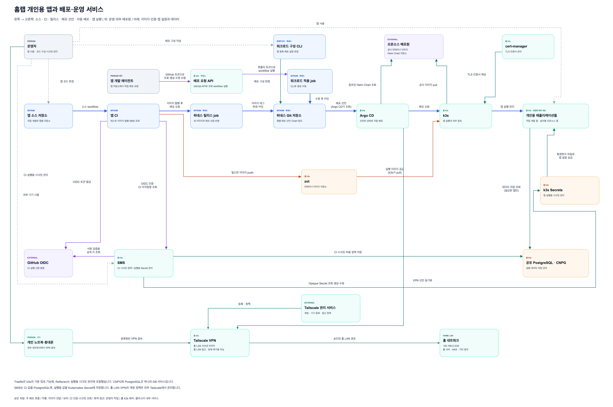

# 홈랩 앱과 배포·운영 서비스

하네스의 유일한 시스템 그림이다. 편집 원본은 [draw.io 파일](homelab-application-platform.drawio)이고, PNG는 원본에서 만든 미리보기다. 각 요소의 책임과 흐름은 [전체 설계](../architecture/system.md)가 글로 설명한다.



## 그림의 수준

단일 페이지·단일 캔버스 관계도다. k3s 안의 서비스는 역할만 가진 상자 하나로 그리고, 실제 프로세스·컨트롤러나 저장소 내부 구조는 펼치지 않는다.

- Traefik은 k3s의 기본 앱 접속 기능에 포함한다. 공용 HTTPS 정책도 이 기능 안의 설정이므로 따로 그리지 않는다.
- CNPG와 공유 PostgreSQL은 DB 서비스 하나로 합친다.
- Reflector는 실행용 시크릿 관리에 포함한다.
- Argo CD, zot, cert-manager, k3s Secrets, SMS, Tailscale VPN은 각각 역할만 표시한다. VPN은 홈 LAN 접근용이며 장애 복구용이 아니다.
- 개인용 앱들은 동등한 배포 대상 하나의 그룹으로 그린다. 특정 앱이 구조의 중심이 되지 않는다.
- 응답선과 서비스 내부 동작은 생략한다.

## 배치와 범례

주 배포 흐름은 왼쪽에서 오른쪽으로 한 줄에 둔다. 앱 소스 저장소, 앱 CI, 하네스 릴리스 job, 하네스 Git 저장소, Argo CD, k3s, 개인용 애플리케이션 순서다.

- 위쪽에는 운영자의 배포 구성 작업, 앱 개발 에이전트와 배포 요청 API, 외부 배포원과 인증서 서비스를 둔다.
- 아래쪽에는 CI에서 k3s로 가는 이미지 전달 경로를 둔다.
- OIDC와 SMS는 CI 아래에, 실행용 시크릿과 DB는 앱 아래에 둔다. SMS는 CI 값을 DB에 저장하고 일반 앱용 실행 값을 Kubernetes Secret에 직접 등록·수정한다.
- 맨 아래에는 외부 개인 기기, Tailscale VPN, 홈 LAN 경로와 외부 Tailscale 관리 서비스를 둔다.

| 선 | 뜻 |
| --- | --- |
| 굵은 파란 선 | 주 배포 흐름과 하네스 Git 반영 |
| 회색 점선 | 운영자의 직접 작업 |
| 보라색 선 | 인증과 시크릿 조회, 토큰으로 하는 요청 |
| 주황색 선 | 이미지 전달 |

화살표는 라벨에 적힌 호출·처리·값 공급 방향이다. Git에서 Argo CD로, zot에서 k3s로 가는 선은 정보가 흘러가는 방향으로 그리고 실제로 조회하거나 pull하는 주체를 라벨에 적었다. 배포 요청 API가 GitHub API로 하네스 Git을 읽는 관계는 상자 설명에 적고 선은 생략했다.

## 그림 고치기

1. [draw.io](https://www.drawio.com/)로 원본을 고친다. 상자와 선은 기존 스타일을 복사해 쓴다.
2. 저장소 루트에서 PNG를 다시 만든다.

   ```bash
   python3 tools/render_diagram.py
   ```

   스크립트는 원본을 바꾸지 않는다. 렌더링용 사본을 만들어 헤드리스 Chrome으로 3540×2350 PNG를 찍고, 기존 내보내기와 여백을 맞추려고 사본에만 투명한 기준 셀을 넣는다. 찍은 PNG에서 흰색이 아닌 픽셀이 5%보다 적으면 뷰어가 그리지 못한 것으로 보고 기존 PNG를 그대로 둔다. Chrome(또는 Chromium)과 jsDelivr 접속이 필요하다. Chrome을 찾지 못하면 `--chrome`으로 실행 파일을 지정한다.
3. 만든 PNG를 열어 라벨과 선이 겹치거나 잘리지 않았는지 눈으로 확인한다.
4. 원본과 PNG를 같은 커밋에 넣는다.

뷰어는 원본 XML의 `mxfile` 버전과 같은 draw.io 태그로 고정한다(`tools/render_diagram.py`의 `VIEWER_URL`). draw.io가 저장한 버전이 바뀌면 이 태그도 함께 올린다. 두 값이 다르면 `tests/test_render_diagram.py`가 실패한다. 같은 원본이라도 Chrome이나 글꼴이 다르면 PNG 바이트가 달라질 수 있으므로 픽셀 단위 일치는 요구하지 않는다.
